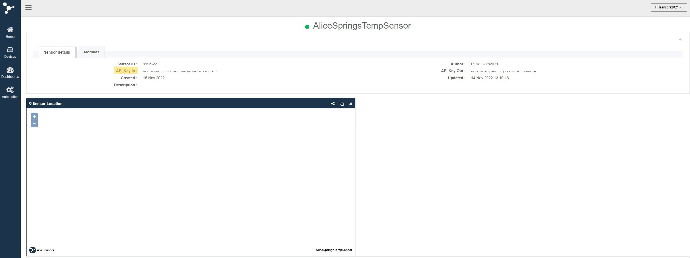

<div align="center">
  <h3 align="center">Purple House Remote Telemetry Module Setup and User Manual</h3>
  <p align="center">
    Code installation and Microcontroller integration
  </p>
</div>

<!-- TABLE OF CONTENTS -->
<details>
  <summary>Table of Contents</summary>
  <ol>
    <li><a href="#about-the-project">About The Project</a></li>
    <li><a href="#getting-started">Getting Started</a></li>
    <ul>
      <li><a href="#ESP32-package-installation">ESP32 Package Installation</a></li>
      <li><a href="#Additional-Library-installation">Additional Library Installation</a></li>
      <li><a href="#Remote-Telemetry-Module-Code-Installation">Remote Telemetry Module Code Installation</a></li>
      <li><a href="#Preparing-AskSensors">Preparing AskSensors</a></li>
    </ul>
    <li><a href="#flashing-code-onto-Device">Flashing Code onto Device</a></li>
    <li><a href="#Data-Visualisation">Data Visualisation</a></li>
  </ol>
</details>


<!-- ABOUT THE PROJECT -->
## About The Project
Source Repo for remote telemetry module prototype developed on behalf of and in conjunction with, The Purple House. Project developed by Noah Correa, Simor Demetriou, Tommaso De Battista, Elliot Garnett, Joshua Gregerson, Jonathan Lee, Zachary Monier Gorton, Max Neville, Sachin Singham, and Adam Tan for School of Mechanical and Manufacturing Engineering Undergraduate Thesis at The University of New South Wales.


<!-- GETTING STARTED -->
## Getting Started
* Ensure the latest version of Arduino IDE software is installed (2.0.1), which can be downloaded from [Arduino.cc](https://www.arduino.cc/en/software/).
* Ensure the ESP32 Add-on is installed in the Arduino IDE. See below for steps to complete this. 

### ESP32 Package Installation
1. In the Arduino IDE, go to: 
    ```sh
    File>preferences
    ```
2. In the `Additional Board Manager URLs` field, enter:
    ```sh
    https://raw.githubusercontent.com/espressif/arduino-esp32/gh-pages/package_esp32_index.json
    ```
    and then click "OK"

3. In the Arduino IDE, open the Boards Manager by clicking through:
    ```sh
    Tools>Board>Boards Manager
    ```
    
4. In Boards Manager, search for ESP32 and install:
    ```sh
    "ESP32 by Espressif Systems"
    ```
5. Test the installation and compatibility of the ESP32 board package 
    
    Plug the physical device into the computer using the USB cable. 
    * In Arduino IDE, select the board by clicking through:
    ```sh
    Tools>Board>esp32>Adafruit ESP32 Feather
    ```
    * Select the Port used to connect the board to the computer by clicking through:
    ```sh
    Tools>Port>"The_COM_Port_Used_by_You"
    ```
    If the COM port cannot be found, install a USB to UART Bridge using the following [tutorial](https://www.silabs.com/developers/usb-to-uart-bridge-vcp-drivers).

### Additional Library Installation
1. In Arduino IDE, navigate to the Library Manager:
#### `Sketch>Include Library>Manage Libraries`

2. Using the search box, install the following four library packages:
    Search `OneWire` and install:
    ```sh
    "OneWire" library by Jim Studt et al.
    ```
    Search `Dallas` and install:
    ```sh
    "DallasTemperature" by Miles Burton et al. 
    ```
    Search `GFX` and install:
    ```sh
    "Adafruit GFX Library" by Adafruit
    ```
    Search `SH110X` and install:
    ```sh
    "Adafruit SH110X" by Adafruit
    ```
    
    * Note that if there are additional dependencies required for the libraries listed above, choose the `INSTALL ALL` selection when asked if you would like to install all the missing dependencies.


3. Restart Arduino IDE after installing library packages.

### Remote Telemetry Module Code Installation (2 methods)
#### Method 1: Using Git (preferred method to enable version control if changes are to be made)

If the user has not installed Git onto their system, use this [tutorial](https://github.com/git-guides/install-git) to do so before continuing.

Now the user has Git installed, clone the repo into the desired location using the following steps:
1. Open the command prompt if using windows, and navigate to the desired folder for storing the repo.
    To do this, use the commands `cd` and `dir` as required to navigate between folders. A tutorial on this can be found [here](https://www.digitalcitizen.life/command-prompt-how-use-basic-commands/)
2. Clone the repo by pasting this command into the command prompt once the desired folder location is reached.
    ```sh
    git clone https://github.com/ASingham/MMAN4020_T3_2022_Purple_House.git
    ```
3. To check if the clone was successful, navigate into the newly created repo using the following command:
    ```sh
    cd MMAN4020_T3_2022_Purple_House
    ```

#### Method 2: Downloading a zip file (Easiest method if version control isn't neccessary): 
1. On the repo homepage, click on the green code icon to bring up the following menu:


2. Click on the `Download ZIP` icon in the drop down menu to download a copy of the repo folder to your local device.

3. In your document manager on your local device, navigate to downloads, unzip the folder, and move the unzipped contents to the desired location. 

### Preparing AskSensors
1. In a web browser, go to the [AskSensors website](https://asksensors.com/home.html) and login using the Purple House login details

2. From the AskSensors home page, navigate to the Sensor devices page.

  
3. Press the orange `+ New Sensor` button to create a new device object that will contain the data for the new Remote Telemetry Device.

4. Fill in the required fields: 
    * press the `+ Add Module` button until 4 modules have been created for the new Sensor device. 
    * Name the sensor as appropriate based on the location of deployment. This field is highlighted in yellow below.
    * Name the four modules highlighted in blue below by pressing the pink `edit` button to the left of each module.
    * If desired and the location is known, fill in the `Latitude` and `Longitude` fields for the location of deployment of the Remote Telemetry Device.

  Save the new sensor object by pressing the orange `save` button in the bottom right.

5. The Sensor devices page should now include the newly made sensor object. Press the green `Visualize` button next to the newly made sensor object which will result in the following page being displayed:


6. Set up graphing capabilities for each Module of the new sensor device.
    To do this, first press into the `Modules` tab. 
    
    Then, for each of the sensor modules, press the navy blue `Add graph` button
    

7. Now, edit the fields to reflect the image below, such that a graphical depiction of the data for each module is created
  

## Flashing Code onto Device
1. Launch Arduino IDE application and from the cloned/downloaded repo, open:
    #### `OneSensorOLEDAskSensorSetup.ino`

2. Navigate within the `MMAN4020_T3_2022_Purple_House_Final_Solution.ino` file to lines `24` and `25` showing:
    ```sh
    const char* ssid = "INPUT WiFi SSID"; // Wifi SSID
    const char* password = "INPUT WiFi Password"; // Wifi Password
    ```
    Edit the characters in inverted commas within these two lines to reflect the Wi-Fi SSID network name and the Wi-Fi password that the device is to be connected to.

3. If desired, the interval at which the temperature sensor collects and transmits data to AskSensors can be changed. 
    To change this parameter, locate line `28` in file `MMAN4020_T3_2022_Purple_House_Final_Solution.ino` and change the value to the desired value in milliseconds.
    ```sh
    const unsigned long writeInterval = 25000; // write interval (in ms)
    ```

3. Find the unique API key for the AskSensor sensor device setup earlier.
    
    In a web browser, go to the [AskSensors website](https://asksensors.com/home.html) and login using the Purple House login details.
    
    From the AskSensors home page, navigate to the Sensor devices page.
    

    Select the respective sensor device and locate the `API Key In` under the `Sensor details tab`
    

4. Return to Arduino IDE and navigate back to the `MMAN4020_T3_2022_Purple_House_Final_Solution.ino` file. Find line `30` showing:
    ```sh
    String apiKeyIn = "RanDomlEtTerAnDnUmbERsEQueNcE124"; // API Key
    ```

5. Save the file after the changes are made

6. As before, plug the device into the computer using the USB cable, and select both the board and the port from the Tools menu.
    ```sh
    Tools>Board>esp32>Adafruit ESP32 Feather
    ```
    ```sh
    Tools>Port>"The_COM_Port_Used_by_You"
    ```
7. Press the Upload button in the Arduino IDE to compile the code and upload it to the connected board. 
    
    After a few seconds the output banner should display:
    ```sh
    "Done uploading"
    ```

8. Open the Serial Monitor in the Arduino IDE by pressing the button highlighted by the red circle below

    
9. To see the output from the board, set the baud rate to `115200` in the serial monitor

10. The serial monitor output should show the following output messages if the code has been correctly flashed and device is working correctly:


11. After the upload is complete, whilst the serial monitor is displaying the above and the device is booting up, the OLED screen should display the following sequentially:


## Device Shutdown Procedure
To shutdown the remote telemetry module, all power supplies to the board must be disconnected. This includes both the micro-USB and the LiPO battery if connected.

If no battery is connected and only micro-USB is being used to power the device, disconnection can occur from outside the housing by unplugging the micro-USB cable from the power source.

However, if a LiPO battery is installed, use the following steps:
1.  First remove the clear enclosure lid to allow access to the component connections.

2.  Once inside, remvoe the micro-USB connection (if disconnection from the board end is preferred).

3.  Then, remove the power supply coming from the battery by carefully removing the JST-PK plug from the socket on the board. 
    ** Note, this plug may be difficult to pull out, but avoid using excessive force to ensure no damage to the components or connections is caused.

#### Additional instructions around power management and charging/using the battery can be found in the Battery Manual contained `here`

## Data Visualisation
1. Visualising the live temperature data received from the operating device
    Log into the [AskSensors website](https://asksensors.com/home.html) using the Purple House login details.
    
    Navigate to the Sensor devices page and press the green `Visualise` button to open the sensor details page. This will contain the previously created series of graphs for live data visualisation. 
    

    ** Note: A custom dashboard can be created to display user specified graphs and visuals. A tutorial for this can be found [here](https://doc.asksensors.com/docs/d/s1/dashboard-customization/)
    
    ### Important: Data published to AskSensor is retained for 18 months
    
2. Exporting AskSensors data for longterm data storage and further data visualisation
    
    AskSensor allows for the data sent to it to be downloaded into CSV format as follows:
    1. As previously, log into the [AskSensors website](https://asksensors.com/home.html) and navigate to the Sensor Devices page.
    2. Select the green `visualise` button next to the appropriate sensor device.
    3. Press the small widget in the top right corner of the desired Temp Sensor module graph as shown below
      
    
    4. Once prompted, select the `Latest data` export type and the `CSV` format followed by the green `Export` button.
    
3. Further detailed data analysis using developed Web App
    A server based web application was developed for further analysis of the temperature data.
    
    This web app can be accessed from anywhere using the following address: 
    ```sh
    https://unswpurplehousedata.web.app/
    ```
    and should appear as:
    
    
    The site allows for the upload of up to 4 CSV files from AskSensors at a time. 
    
    Using the above steps, the desired CSV files can be exported from AskSensors, to be then uploaded to the web app.
    
    After uploading the desired CSV files, click the purple `SUBMIT` button to load the CSV files into the data analysis web app for visual display.
    
    ## Using the Data Visualisation Web App
    
    The dashboard home displays four different ranged graphical depictions of the uploaded data: `Today`, `Last 24 Hours`, `Average Temperature This Week`, and `Average Temperature This Year`. 
    
    When more that `one` file is uploaded, a banner at the top of the page allows for the selection of data set to be displayed graphically. 
    
    By hovering over individual data points in the graphs, specific temperature values are provided.
    
      
    In addition to the dashboard homepage, the web app allows for the user to visualise specific  dates by pressing the `View By Date` button in the top most banner. The desired date can be set using the calender function to the right of the `Date Search` banner.
    
    
    To swap out csv files or to upload new files, either refresh the webpage or press the `NEW FILE` button in the top right corner. 
    
    Additionally, the data visualisation tools can be customised using the settings widget in the top right corner.
    
    ** Note: The web app can handle approximately 600 uploads of csv files per day without requiring a subscription service cost for server hosting.
    

    
